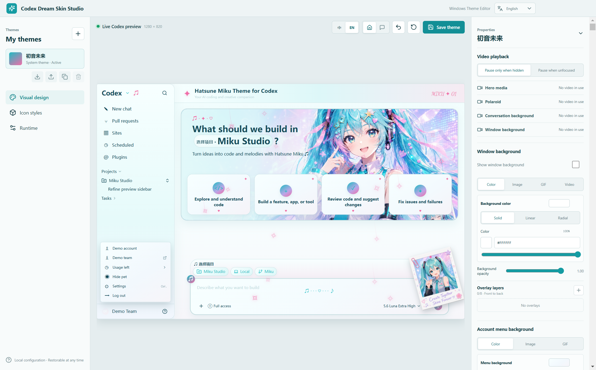

# Codex Dream Skin Studio

**English** | [简体中文](README.zh-CN.md)

Codex Dream Skin Studio is an unofficial visual theme editor for the official Codex desktop app. It lets you design themes locally, preview them in a Codex-style workspace, and apply them through a verified local connection on Windows and macOS.

The Studio does not modify the Codex installation, `app.asar`, application signature, or files inside WindowsApps. It backs up the relevant Codex configuration before making changes and provides a guided restore workflow.



## Features

- Create, duplicate, edit, switch, and delete local theme profiles with a live preview.
- Use PNG, JPEG, WebP, SVG, GIF, MP4, or WebM assets for hero media, polaroids, full-window backgrounds, and conversation backgrounds.
- Customize colors, gradients, layered masks, typography, icons, particles, home-page copy, cards, the composer, and chat bubbles.
- Preview both the home page and conversation view, with quick editing from preview elements.
- Export complete themes as portable `.cdstheme` files and import them on either supported platform.
- Detect and connect only to a verified official Codex installation, then reinject, verify, stop, or fully restore the theme from the Studio.
- Use the Studio interface in English or Simplified Chinese.

## Download and requirements

Download the latest installer from [GitHub Releases](https://github.com/269289854/Codex-Dream-Skin-electron/releases).

| Platform | Requirements | Package |
| --- | --- | --- |
| Windows | Windows 10/11 x64 and the official Codex app installed from Microsoft Store | `Codex-Dream-Skin-Studio-Setup-<version>.exe` |
| macOS | macOS 12 or later, Intel or Apple Silicon, and a signature-verified official Codex app | Universal DMG or ZIP |

The installed app does not require Node.js. Current macOS builds are unsigned and unnotarized, so the first launch may require right-clicking the app in Finder and choosing **Open**, or approving it in **System Settings > Privacy & Security**. Do not disable Gatekeeper globally or modify the official Codex app bundle.

## How to use

1. Install and open the official Codex desktop app, then install Codex Dream Skin Studio from the latest release.
2. Create or select a theme. Import media and customize the layout, colors, typography, icons, effects, and other appearance settings in the live preview.
3. Select **Save theme**, open **Runtime**, run **Detect Codex**, and then select **Start and apply**. Confirm a Codex restart when prompted.
4. After later edits, save and select **Reinject**. When you want to remove the theme and restore the previous Codex configuration, select **Restore and restart Codex**.

Themes can also be exported or imported as self-contained `.cdstheme` files. See the [Chinese user guide](docs/USER_GUIDE.md) for detailed media limits, theme sharing, runtime behavior, data locations, and troubleshooting.

## Safety and privacy

- Codex configuration is backed up before it is changed. Writes use strict UTF-8 validation, atomic replacement, and rollback on failure.
- The runtime connection is restricted to verified local Codex processes and loopback CDP endpoints owned by those processes.
- Imported paths, file types, media headers, asset sizes, SVG content, and shared-theme archives are validated before use.
- The renderer cannot directly access Node.js, the filesystem, PowerShell, system tools, or arbitrary CDP addresses.
- Preview fixtures and committed screenshots use public or fictional data and do not synchronize personal Codex projects, tasks, accounts, or teams.

For the complete boundaries, see [Privacy and example data](docs/PRIVACY.md).

## Development

Development requires Node.js 22 or later. This repository uses `npm` and the committed `package-lock.json`.

```bash
npm install
npm run dev
```

Run the standard checks and build:

```bash
npm run typecheck
npm test
npm run build
```

Windows configuration tests require PowerShell:

```powershell
npm run test:config
```

Package on the target platform when needed:

```bash
# Windows x64 NSIS installer
npm run package:win

# macOS Universal DMG and ZIP
npm run package:mac
```

Generated packages are written to `release/` and should not be committed.

## Documentation

- [User guide (Simplified Chinese)](docs/USER_GUIDE.md)
- [Privacy and example data](docs/PRIVACY.md)
- [Platform QA results](docs/QA_RESULTS.md)
- [Build and release guide (Simplified Chinese)](docs/GITHUB_ACTIONS_RELEASE.md)
- [Open-source and third-party notices](NOTICE.md)

## Project status

This public repository is independently maintained and is not an OpenAI product. It was migrated from [Fei-Away/Codex-Dream-Skin](https://github.com/Fei-Away/Codex-Dream-Skin) and continues development here.

Windows 10/11 x64 and macOS 12+ are supported. Linux is not currently supported. Windows automatic updates remain available in installed releases; macOS updates are currently manual.

## License

The source code is available under the [MIT License](LICENSE). See [NOTICE.md](NOTICE.md) for project attribution, bundled fonts, and third-party components.
