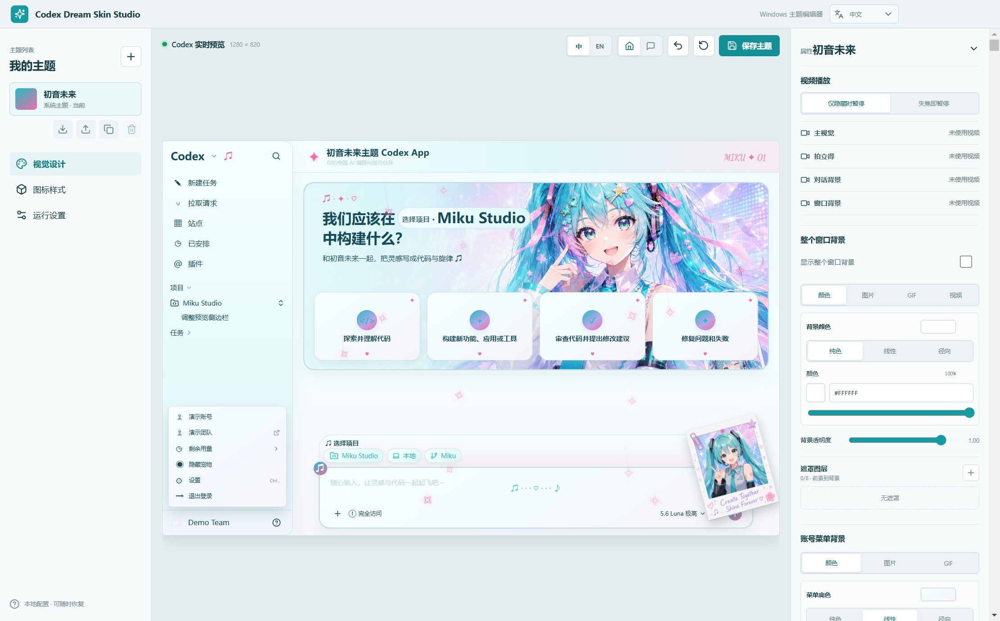

# Codex Dream Skin Studio

[English](README.md) | **简体中文**

Codex Dream Skin Studio 是一款面向官方 Codex 桌面应用的非官方可视化主题编辑器。它支持在本地设计主题、在 Codex 风格的工作区中实时预览，并通过受验证的本机连接将主题安全应用到 Windows 或 macOS 上的 Codex。

Studio 不会修改 Codex 安装文件、`app.asar`、应用签名或 WindowsApps 中的文件。修改相关 Codex 配置前会先创建备份，并提供完整的引导式恢复流程。



## 主要功能

- 创建、复制、编辑、切换和删除多个本地主题，并实时预览效果。
- 使用 PNG、JPEG、WebP、SVG、GIF、MP4 或 WebM 素材配置主视觉、拍立得、整个窗口背景和对话区域背景。
- 自定义颜色、渐变、多层遮罩、字体、图标、粒子、首页文案、快捷卡片、输入框和聊天气泡。
- 预览首页与会话页面，并直接点击预览元素进入对应的快速编辑项。
- 将完整主题导出为可移植的 `.cdstheme` 文件，并在任一受支持平台导入。
- 仅检测并连接经过验证的官方 Codex 安装，随后可在 Studio 中重新注入、验证、停止或完整恢复主题。
- Studio 界面支持简体中文和英文。

## 下载与环境要求

请从 [GitHub Releases](https://github.com/269289854/Codex-Dream-Skin-electron/releases) 下载最新安装包。

| 平台 | 环境要求 | 安装包 |
| --- | --- | --- |
| Windows | Windows 10/11 x64，以及从 Microsoft Store 安装的官方 Codex | `Codex-Dream-Skin-Studio-Setup-<version>.exe` |
| macOS | macOS 12 或更新版本，支持 Intel 与 Apple Silicon，并安装签名验证通过的官方 Codex | Universal DMG 或 ZIP |

安装版不要求单独安装 Node.js。当前 macOS 构建未签名且未公证，首次启动时可能需要在 Finder 中右键应用并选择“打开”，或前往“系统设置 > 隐私与安全性”确认打开。不要全局关闭 Gatekeeper，也不要修改官方 Codex 应用包。

## 使用方法

1. 安装并打开官方 Codex 桌面应用，然后从最新 Release 安装 Codex Dream Skin Studio。
2. 创建或选择主题，在实时预览中导入素材并调整布局、颜色、字体、图标、特效和其他外观设置。
3. 点击“保存主题”，打开“运行设置”，依次执行“检测 Codex”和“启动并应用”；出现提示时确认重启 Codex。
4. 后续修改主题后，先保存再点击“重新注入”。需要移除主题并恢复原 Codex 配置时，点击“恢复并重启 Codex”。

主题也可以通过自包含的 `.cdstheme` 文件导出和导入。媒体限制、主题分享、运行机制、数据目录和故障排查详见[使用指南](docs/USER_GUIDE.md)。

## 安全与隐私

- 修改 Codex 配置前创建备份，并使用严格 UTF-8 校验、原子替换和失败回滚。
- 运行时连接仅允许经过验证的本机 Codex 进程，以及由对应进程拥有的回环 CDP 端点。
- 使用素材前会校验路径、文件类型、媒体文件头、素材大小、SVG 内容和主题分享包。
- 渲染进程不能直接访问 Node.js、文件系统、PowerShell、系统工具或任意 CDP 地址。
- 预览夹具与提交到仓库的截图只使用公开或虚构数据，不会同步个人 Codex 项目、任务、账号或团队信息。

完整约束见[隐私与示例数据](docs/PRIVACY.md)。

## 开发

开发构建需要 Node.js 22 或更新版本。项目使用 `npm` 和已提交的 `package-lock.json`。

```bash
npm install
npm run dev
```

运行标准检查和构建：

```bash
npm run typecheck
npm test
npm run build
```

Windows 配置测试依赖 PowerShell：

```powershell
npm run test:config
```

需要安装包时，请在目标平台执行：

```bash
# Windows x64 NSIS 安装包
npm run package:win

# macOS Universal DMG 和 ZIP
npm run package:mac
```

生成的安装包位于 `release/`，不应提交到仓库。

## 相关文档

- [使用指南](docs/USER_GUIDE.md)
- [隐私与示例数据](docs/PRIVACY.md)
- [平台验收结果](docs/QA_RESULTS.md)
- [GitHub Actions 双平台构建与发布手册](docs/GITHUB_ACTIONS_RELEASE.md)
- [开源与第三方声明](NOTICE.md)

## 项目状态

这是一个独立维护的公开仓库，不是 OpenAI 官方产品。项目从 [Fei-Away/Codex-Dream-Skin](https://github.com/Fei-Away/Codex-Dream-Skin) 迁移而来，并在本仓库继续开发。

当前支持 Windows 10/11 x64 和 macOS 12+，暂不支持 Linux。Windows 正式安装版保留自动更新；macOS 目前需要手动更新。

## 许可证

项目源代码采用 [MIT License](LICENSE)。项目来源、内置字体和第三方组件说明见 [NOTICE.md](NOTICE.md)。
